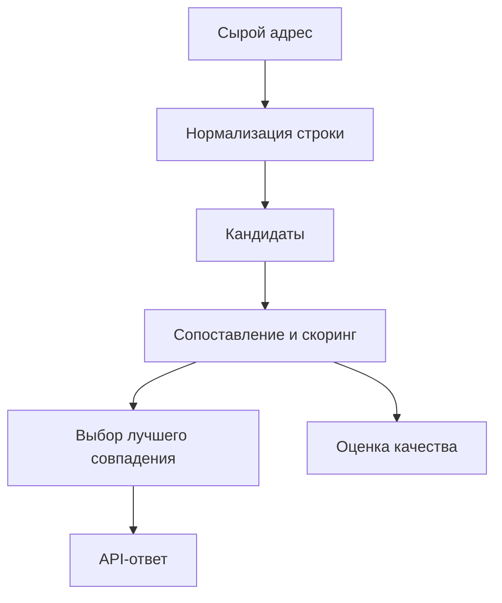

# Сервис сопоставления московских адресов

## Кратко
Сервис сопоставления адресных строк с адресным справочником: baseline и improved pipeline, API, контейнеризация и оценка качества совпадений.

## Задача
Решить задачу нечёткого сопоставления московских адресов, где пользовательский ввод может содержать сокращения, ошибки, неполные поля и неоднозначные формулировки.

## Что улучшено
- improved pipeline повышает качество сопоставления относительно baseline за счёт нормализации, поэтапного matching и дополнительных правил;
- сервисная упаковка упрощает интеграцию и воспроизводимость;
- отдельные документы по архитектуре и оценке сворачиваются в один сильный README.

## Архитектура


## Метрики и результаты
| Режим | Текстовое сходство | Географическая ошибка | Успешные совпадения | latency |
|---|---:|---:|---:|---:|
| baseline | TBD | TBD | TBD | TBD |
| improved pipeline | TBD | TBD | TBD | TBD |

Если реальные цифры лежат в `SCORE_EXPLANATION.md` или отчётах — подставить их сюда.

## Структура репозитория
- `src/` — логика сопоставления;
- `scripts/` — вспомогательные сценарии;
- `static/` — статические артефакты интерфейса;
- `ARCHITECTURE.md`, `DOCKER.md`, `SCORE_EXPLANATION.md` — дополнительные документы, ключевые идеи из которых нужно перенести в README.

## Запуск
```bash
python -m venv .venv
source .venv/bin/activate
pip install -r requirements.txt
docker compose up --build
```

## Ограничения
- качество зависит от качества исходного справочника;
- адресные формулировки вне домена Москвы не являются целевым сценарием;
- часть эвристик требует донастройки под новые типы запросов.

## Направления развития
- добавить расширенную аналитику ошибок по типам адресов;
- вынести правила нормализации в конфиг;
- добавить пакетный режим сравнения;
- покрыть сервис интеграционными тестами на наборе эталонных кейсов.
